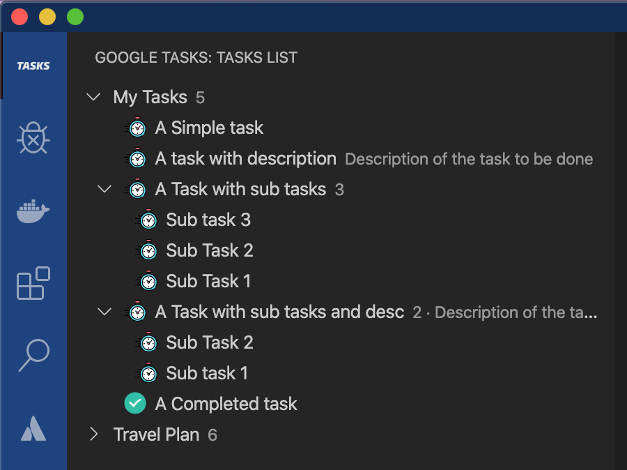
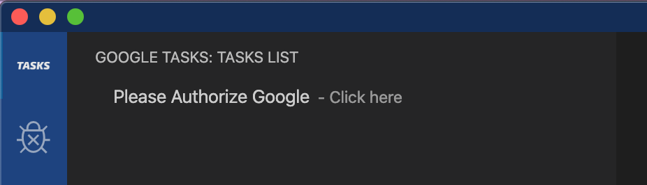

# Google Tasks for VSCode with Google Calendar Integration

Manage your Google Tasks directly from VS Code without leaving your editor. Access your entire task list, create new tasks, edit existing ones, and integrate with your calendar—all within Visual Studio Code.

> **Note:** This is **not** an official Google product. This is an unofficial extension created by SeriesOfUnlikelyExplanations.

---

## 📖 Overview

Google Tasks for VSCode is an unofficial VS Code extension that brings the power of Google Tasks directly into your development environment. Whether you're managing personal tasks, project todos, or team assignments, this extension lets you stay focused on your code without context switching.

Built with TypeScript and leveraging the official Google Tasks and Google Calendar APIs, this extension provides a seamless, secure, and intuitive way to manage your tasks. All authentication is handled through Google's secure OAuth 2.0 protocol, and your data is never stored externally.

---

## ✨ Key Features

- **📋 View All Tasks** - See your entire Google Tasks list in a convenient tree view within VS Code's sidebar
- **✏️ Create & Edit** - Create new tasks, edit existing ones, and manage task details without leaving your editor
- **🗑️ Delete Tasks** - Remove completed or unwanted tasks directly from the extension
- **📅 Calendar Integration** - Sync your tasks with Google Calendar to see due dates and calendar events
- **🤖 AI-Powered Itinerary Generation** - Regenerate adventure itineraries using Vertex AI integration
- **📂 Smart Subtask Handling** - Properly nested subtasks that stay organized under parent tasks
- **✨ Enhanced Loading Experience** - Beautiful animated loading screens with dynamic content
- **🔐 Secure Authentication** - OAuth 2.0 authentication ensures your credentials are never shared or stored locally
- **☁️ Real-time Sync** - Changes sync automatically with your Google Tasks account

---

## 🛠️ Technology Stack

This extension is built using modern web technologies and official Google APIs to ensure reliability and security:

- **TypeScript** - Type-safe development
- **Google Tasks API v1** - Official task management API
- **Google Calendar API v3** - Calendar integration API
- **Google Vertex AI** - AI-powered itinerary regeneration
- **OAuth 2.0** - Secure authentication protocol
- **VS Code API** - Native VS Code integration

---

## 🚀 Getting Started

### Requirements

- Visual Studio Code **v1.52.0** or higher
- Google Account with access to Google Tasks
- Internet connection for syncing

### Installation Steps

1. **Install the extension**
   - Search for "Google Tasks for VSCode" in the VS Code Extensions marketplace and click Install
   - Or [click here to install directly](https://marketplace.visualstudio.com/items?itemName=SeriesOfUnlikelyExplanations.vscode-google-tasks-extension)

2. **Open the extension**
   - Look for the Google Tasks icon in your VS Code sidebar

3. **Authorize Google**
   - Click the "Authorize Google" button in the extension panel

4. **Follow OAuth flow**
   - You'll be taken to Google's authentication page
   - Sign in with your Google account

5. **Grant permissions**
   - Authorize the extension to access your Google Tasks and Google Calendar

6. **Start managing**
   - Your Google Tasks will appear in the sidebar, ready to manage

### First Steps

- Click on a task to view its details
- Right-click on tasks for quick actions (edit, delete, mark complete)
- Click the "+" button to create a new task
- Expand task lists to see subtasks and task details
- Check your calendar view to see tasks with due dates

---

## 📸 Screenshots

### Task List in Sidebar

### Secure OAuth Authorization

---

## 🎯 Features Deep Dive

### 📋 Task Management

The extension provides full CRUD (Create, Read, Update, Delete) operations for your Google Tasks. Manage your task lists, create new tasks with descriptions, set due dates, and mark tasks as complete without ever leaving VS Code. The tree view provides an intuitive hierarchical display of your task lists and individual tasks.

### 📅 Calendar Integration

Integrate your tasks with Google Calendar to see your tasks alongside your calendar events. View tasks with due dates in a calendar context, helping you plan your day more effectively. This integration uses the official Google Calendar API v3 to ensure compatibility and reliability.

### 📝 Date Picking

When creating or editing tasks, a simple date selection UI allows you to set due dates easily. The extension handles date formatting and synchronization with Google Tasks, ensuring your due dates are consistent across all your devices.

### 🔄 Real-time Sync

Any changes you make in the extension are immediately synced with your Google Tasks account. Similarly, if you update tasks on other devices, the extension will reflect those changes. This ensures you're always working with the most current task data.

### 🤖 AI-Powered Itinerary Regeneration

The extension features Vertex AI integration for intelligent itinerary generation. When planning adventures or trips, you can use the "Regenerate Itinerary" feature to have AI create optimized task lists with properly nested subtasks. The AI handles complex scheduling and organizes activities into manageable, ordered tasks.

### ✨ Enhanced Loading Experience

Enjoying a polished user experience with animated loading screens that feature dynamic content and smooth transitions. Instead of boring spinners, you'll see engaging animations that make waiting more pleasant.

### 🔐 Secure Authentication

Authentication is handled securely using Google's OAuth 2.0 protocol. Your credentials are never stored on your device or transmitted to third parties. The extension only receives an access token during your session, which is used to interact with the Google Tasks and Calendar APIs.

---

## 🔒 Privacy & Security

- **✓ No Local Data Storage** - The extension only keeps your data in memory during your VS Code session. Nothing is stored to disk or sent to external servers.

- **✓ Secure OAuth 2.0** - All authentication with Google is handled using industry-standard OAuth 2.0 protocol. Your password is never shared with the extension.

- **✓ Third-Party Privacy** - Your data is never transmitted to third parties. The extension only communicates directly with Google's official APIs.

- **✓ Official Google APIs** - The extension uses only the official Google Tasks API v1 and Google Calendar API v3, ensuring maximum compatibility and security.

**Full Privacy Policy**: For complete information about data handling and privacy practices, please read our [full Privacy Policy](PRIVACY_POLICY.md).

**Revoke Access**: You can revoke the extension's access to your Google account at any time through your [Google Account security settings](https://myaccount.google.com/permissions).

---

## ❓ Frequently Asked Questions

### Is this an official Google product?

No, this is an unofficial extension created by SeriesOfUnlikelyExplanations. However, it uses the official Google Tasks API v1 and Google Calendar API v3, ensuring compatibility and reliability.

### Where is my data stored?

Your data exists only in memory during your VS Code session. Nothing is stored locally on your computer or sent to external servers. Changes are synced directly to your Google Tasks account.

### Can I sync with other task managers?

This extension uses the official Google Tasks API, so it integrates with anything that uses Google Tasks. You can use it alongside other Google Task clients (web, mobile, etc.) and changes will sync across all platforms.

### How do I revoke access?

You can revoke the extension's access to your Google account at any time through your [Google Account security settings](https://myaccount.google.com/permissions). Simply find "Google Tasks for VSCode" in your connected apps and remove it.

### What if I encounter issues?

If you experience any problems, please report them on the [GitHub Issues page](https://github.com/SeriesOfUnlikelyExplanations/google-tasks-vscode-extension/issues). Provide details about your VS Code version, the issue you're experiencing, and any error messages.

### Is the extension free?

Yes, this extension is completely free and open source. You can use it at no cost.

### Does the extension work offline?

The extension requires an internet connection to sync with Google Tasks and Google Calendar. However, you can view your cached task data offline once you've authorized the extension.

---

## 📚 Useful Links

- [VS Code Marketplace](https://marketplace.visualstudio.com/items?itemName=SeriesOfUnlikelyExplanations.vscode-google-tasks-extension)
- [GitHub Repository](https://github.com/SeriesOfUnlikelyExplanations/google-tasks-vscode-extension)
- [Report Issues](https://github.com/SeriesOfUnlikelyExplanations/google-tasks-vscode-extension/issues)
- [Privacy Policy](PRIVACY_POLICY.md)

---

## 📝 Release Notes

Please refer to the [CHANGELOG](CHANGELOG.md) for detailed release notes and version history.

---

## 🤝 Contributing

Contributions are welcome! Please feel free to submit a Pull Request.

---

## 📄 License

This project is open source. See the repository for license details.

---

## 👨‍💻 Author

Created by [SeriesOfUnlikelyExplanations](https://github.com/SeriesOfUnlikelyExplanations)

---

**Ready to Get Started?**

[Install Now from VS Code Marketplace](https://marketplace.visualstudio.com/items?itemName=SeriesOfUnlikelyExplanations.vscode-google-tasks-extension)

**Enjoy!** 🚀
